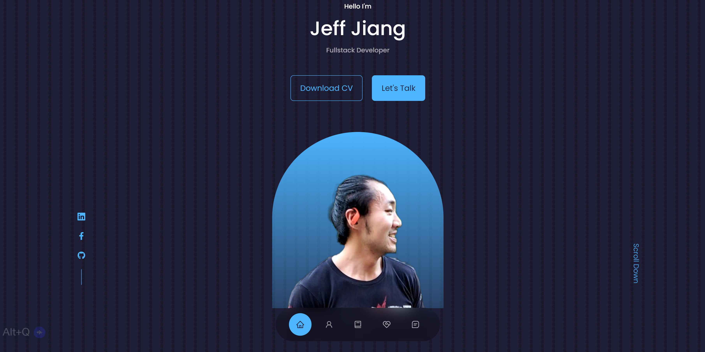

<div align="center" id="top">
  

  &#xa0;

  <a href="https://jeff-jiang.com/">Demo</a>
</div>

<h1 align="center">Portfolio</h1>

<p align="center">
  

  

  

  

  <!--  -->

  <!--  -->

  <!--  -->
</p>

<!-- Status -->

<!-- <h4 align="center">
	🚧  React Portfolio 2022 🚀 Under construction...  🚧
</h4>

<hr> -->

<p align="center">
  <a href="#dart-about">About</a> &#xa0; | &#xa0;
  <a href="#sparkles-features">Features</a> &#xa0; | &#xa0;
  <a href="#rocket-technologies">Technologies</a> &#xa0; | &#xa0;
  <a href="#white_check_mark-requirements">Requirements</a> &#xa0; | &#xa0;
  <a href="#checkered_flag-starting">Starting</a> &#xa0; | &#xa0;
  <a href="#memo-license">License</a> &#xa0; | &#xa0;
  <a href="https://github.com/{{YOUR_GITHUB_USERNAME}}" target="_blank">Author</a>
</p>

<br>

## :dart: About ##

This is my personal portfolio website built with React. It is a single page application that showcases my projects and skills. It also has a contact form that allows users to send me a message directly from the website.

## :sparkles: Features ##

:heavy_check_mark: Feature 1 Downloadable cv;\
:heavy_check_mark: Feature 2 Email messaging system;\
:heavy_check_mark: Feature 3 Interactive portfolio;

## :rocket: Technologies ##

The following tools were used in this project:


- [React](https://pt-br.reactjs.org/)


## :white_check_mark: Requirements ##

Before starting :checkered_flag:, you need to have [Git](https://git-scm.com) and [Node](https://nodejs.org/en/) installed.

## :checkered_flag: Starting ##

```bash
# Clone this project
$ git clone https://github.com/jeffjiang13/Portfolio

# Access
$ cd react-port

# Install dependencies
$ yarn

# Run the project
$ yarn start

# The server will initialize in the <http://localhost:3000>
```

## :memo: License ##

This project is under license from MIT. For more details, see the [LICENSE](LICENSE.md) file.


Made with :heart: by <a href="https://github.com/jeffjiang13" target="_blank">Jeff Jiang</a>
Thank you

&#xa0;

<a href="#top">Back to top</a>
